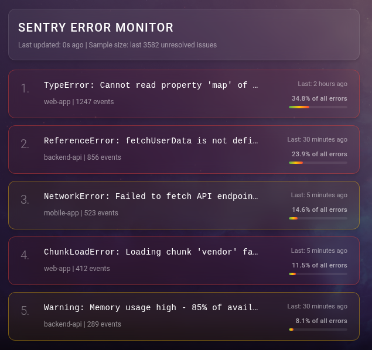

# MMM-Sentry-Monitoring

A [MagicMirror²](https://github.com/MagicMirrorOrg/MagicMirror) module that displays real-time error monitoring from Sentry.io.

## Features

- **Real-time monitoring** of errors from Sentry.io API
- **Visual cards** with severity levels (🔴 error, 🟠 warning, 🔵 info)

## Screenshots



## Installation

```bash
cd ~/MagicMirror/modules
git clone https://github.com/jcalmat/MMM-Sentry-Monitoring.git
cd MMM-Sentry-Monitoring
npm install
```

## Sentry Configuration

1. Create an auth token on [Sentry.io](https://sentry.io): **Settings** → **Developer Settings** → **Personal Tokens**
2. Get your `orgSlug` from your organization settings: **Settings** → **Organizations** → **General Settings** -> Organization Slug

## Configuration

```js
{
  module: "MMM-Sentry-Monitoring",
  position: "top_right",
  config: {
    sentryAuthToken: "your-token",                   // Required
    sentryOrgSlug: "your-org",                       // Required
    updateInterval: 30000,                           // 30 seconds
    displayCount: 5,                                 // Top 5 errors
    sortBy: "freq",                                  // freq, last_seen, first_seen
    minEvents: 1,                                    // Minimum threshold
    timeRange: "7d"                                  // Time range for stats
  }
}
```

### Configuration Options

| Option            | Type     | Default  | Description                                             |
| ----------------- | -------- | -------- | ------------------------------------------------------- |
| `sentryAuthToken` | `string` | `""`     | **Required**. Token with `project:read` scope           |
| `sentryOrgSlug`   | `string` | `""`     | **Required**. Organization slug                         |
| `updateInterval`  | `number` | `30000`  | Update frequency (ms)                                   |
| `displayCount`    | `number` | `5`      | Number of errors displayed                              |
| `sortBy`          | `string` | `"freq"` | Sort by: `freq`                                         |
| `minEvents`       | `number` | `1`      | Minimum event count for the issue to be displayed       |
| `timeRange`       | `string` | `"24h"`  | Time range for stats (e.g., `1h`, `24h`, `7d`)          |
| `environments`    | `array`  | `[]`     | List of environments to filter (e.g., `["production"]`) |

## License

MIT License - see [LICENSE](LICENSE.md) file for details.
